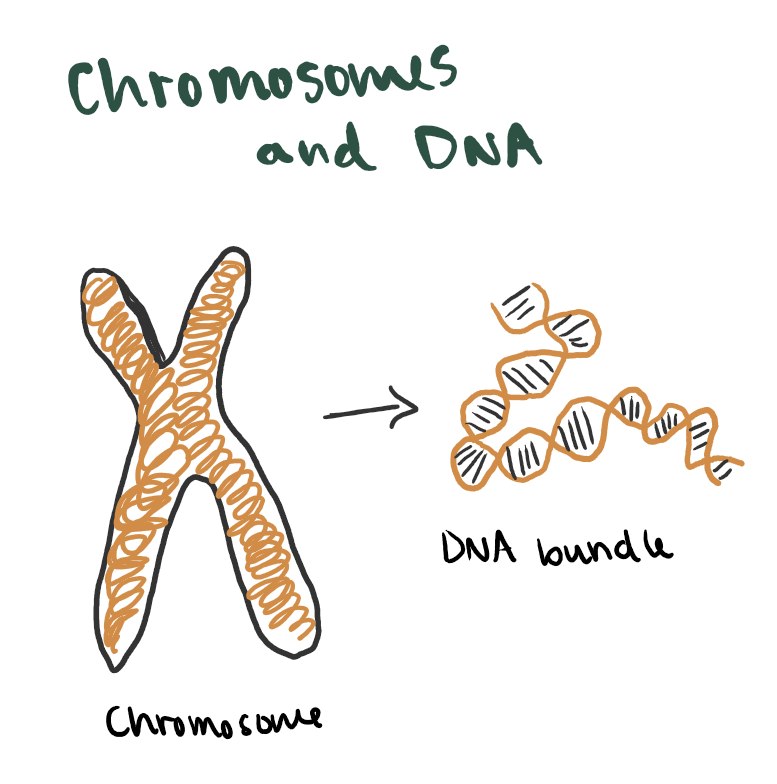
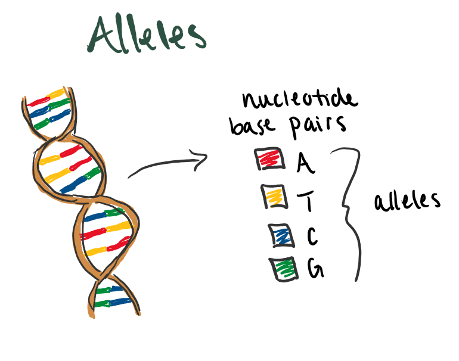

# Genome-Wide Association Studies (GWAS)


### Some Vocabulary {-}

There are many terms that come along with talking about genetic data. The following are some more biology related terms to remember as you read this unit summary. Refer to this list if you forget what a term means.

-   [*SNPs (single nucleotide polymorphisms)*]{.underline}: a single nucleotide at a specific position in the genome, genetic variant at least 1% frequent in the population

    -   [*Genome*]{.underline}: complete set of genes or genetic material

    -   [*Chromosome*]{.underline}: condensed DNA structure, all chromosomes together is the genome

-   [*Genetic variants*]{.underline}: positions where DNA sequences differ

    -   [*SNV (single nucleotide variant)*]{.underline}: a single nucleotide change in the DNA sequence. *SNP* and *SNV* are typically used interchangeably. You might see *SNP* used in instances where the minor allele is not too rare

-   [*Allele*]{.underline}: the different possible nucleotides at some position. The combinations are *A* - *T* and *G* - *C*

-   [*Minor allele*]{.underline}: at this location, which allele is the least common

    -   [*MAF (minor allele frequency)*]{.underline}: the frequency of the minor allele, can get very small

-   [*Loci/locus*]{.underline}: means location, can be used to refer to a single *SNP* or a larger region in the genome


## Introduction to GWAS

  When looking at human DNA, we can see that between any two people, their genomes would be almost exactly identical. However, there are places where their DNA sequences differ. These are called *genetic variants*. Sometimes these variants mean nothing, other times they have been found to be linked to certain traits or health problems. The goal of a genome-wide association study (GWAS), is to determine which genetic variants are associated with a given trait of interest. 
  
### Genome Breakdown

  Before getting too far into GWAS, let's take a moment to dive into some of the science-y details. I created a series of images that break down some of the different vocabulary from above and how they are related.
  
  
  Most humans have 23 pairs of chromosomes. Within each pair, you have one chromosome given from each parent. The chromosome for parent 1 is made up of a mixture of DNA from both of that parent's parents and likewise for the chromosome for parent 2. We can also see that each chromosome is actually just an X-ish shape of DNA all bundled up. When we "unwrap" it, we can see some more levels of terms to remember.

  
```{r, fig.cap="*23 pairs of chromosomes from parents (left) and Chromosome unwound DNA (right)*", out.width="50%", fig.show="hold", echo=FALSE}
knitr::include_graphics("chromosome-pair.png")

```

\

These next two drawings show how the segments of DNA creates an individual's genes and the nucleotides and alleles inside. So, within each long strand of DNA wrapped into the chromosome, there are segments that give us certain traits. These are called genes. The DNA and their genes are made up of four different nucleotide base pairs in between the sugar-phosphate backbone of the DNA (the outside lines). The four nucleotide bases are: adenine (A), thymine (T), cytosine (C), and guanine (G). In the vocab section, I mentioned that these are called alleles and they have specific pairings. A will always be with T just as C will always be with G. 


```{r, fig.cap="*Some gene segment from DNA sequence (left) and Alleles in some gene (right)*", out.width="50%", fig.show="hold", echo=FALSE}
knitr::include_graphics("dna-gene.png")


```

\

Now that we can better understand some genomic structures, let's get back into GWAS

### A small example

  Below is an example of a small study of alleles that can be different at some place along the DNA sequence. The goal of this GWAS study is to see if the pairings of alleles at certain positions have some effect on the trait. We know from before that A and T pair as well as C and G. This means we really only need to list one nucleotide base in our data given the other is known.


|   person ID | parent 1 allele        | parent 2 allele  | trait |
|-------------|----------------|-------------| ----|
| 10005      | A              | A             | 60 | 
| 10006       | A             | G            |  67  |
| 10007       | G             | A             | 68  |
| 10008       | A             | A             | 62  |


Instead of having this more complex table, if we know G is the minor allele in this position we can recode the table. Instead of two columns for A and G, we can have one column combining the two where G is 1 and A is 0. It doesn't matter the order anyways, so this transformation is fine. Here is what that would look like: 

|   person ID | alleles    |trait|
|-------------|------------|-----|
| 10005       | 0          | 60  | 
| 10006       | 1          | 67  |
| 10007       | 1          | 68  |
| 10008       | 0          | 62  |


The typical GWAS model looks like this. Think about what would go into the variables below from our small example. 

$$
E[Y \mid X] = \beta_0 + \beta_1 X
$$

  We are able to use this model easily as our data has only one position of interest, or SNP. But what happens when we have a data set where there are more columns than there are rows $(p>n)$?

  The DNA sequence of a single person consists of an estimated 3 billion nucleotides. While a GWAS will not typically measure every single position, they can still be hundreds of thousands to billions of columns. The "study" we did above was a very reduced example of what a GWAS could look like. So, how can we estimate the effect of some genetic variant on our trait of interest if we cannot use one giant regression model?
  
## Simulating a GWAS


