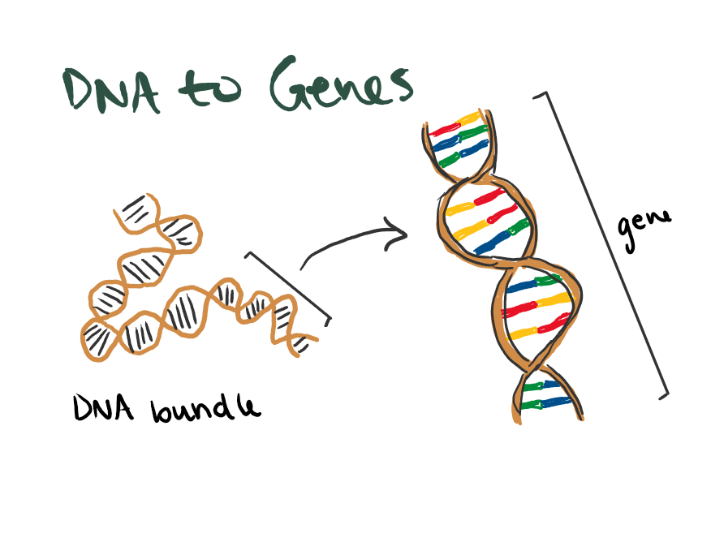

# Genome-Wide Association Studies (GWAS)

\

## Introduction to GWAS

  When looking at human DNA, we can see that between any two people, their genomes would be almost exactly identical. However, there are places where their DNA sequences differ. These are called *genetic variants*. Sometimes these variants mean nothing, other times they have been found to be linked to certain traits or health problems. The goal of a genome-wide association study (GWAS), is to determine which genetic variants are associated with a given trait of interest. 
  
### Genome Breakdown

  Before getting too far into GWAS, let's take a moment to dive into some of the science-y details. I created a series of images that break down some of the different vocabulary from above and how they are related.
  
  
  Most humans have 23 pairs of *chromosomes*. Within each pair, you have one chromosome given from each parent. The chromosome for parent 1 is made up of a mixture of DNA from both of that parent's parents and likewise for the chromosome for parent 2. We can also see that each chromosome is actually just an X-ish shape of DNA all bundled up. When we "unwrap" it, we can see some more levels of terms to remember.

  
```{r, fig.cap="*23 pairs of chromosomes from parents (left) and Chromosome unwound DNA (right)*", out.width="50%", fig.show="hold", echo=FALSE}
knitr::include_graphics("images/chromosome-pair.png")
knitr::include_graphics("images/chromosome-dna.png")
```

\

These next two drawings show how the segments of DNA creates an individual's genes and the nucleotides and *alleles* inside that create a genetic variant. So, within each long strand of DNA wrapped into the chromosome, there are segments that give us certain traits. These are called genes. The DNA and their genes are made up of four different nucleotide base pairs in between the sugar-phosphate backbone of the DNA (the outside lines). The four nucleotide bases are: adenine (A), thymine (T), cytosine (C), and guanine (G). In the vocab section, I mentioned that these are called alleles and they have specific pairings. A will always be with T just as C will always be with G. 

We can see in these visualizations that we can zoom into some segement of DNA and see a *SNV* where there are two possible alleles. This is called *biallelic*. 


```{r, fig.cap="*Some gene segment from DNA sequence (left) and genetic variant (right)*", out.width="50%", fig.show="hold", echo=FALSE}

knitr::include_graphics("images/dna-genetic-variant.png")

```

\

Now that we can better understand some genomic structures, let's get back into explaining GWAS.

### A small example

  Below is an example of a small study of alleles that can be different at some place along the DNA sequence. We can call this a biallelic genetic variant. The goal of this GWAS study is to see if the pairings of alleles at certain positions have some effect on the trait. We know from before that A and T pair as well as C and G. This means we really only need to list one nucleotide base in our data given the other is known.


|   person ID | parent 1 allele        | parent 2 allele  | trait |
|-------------|----------------|-------------| ----|
| 10005      | A              | A             | 60 | 
| 10006       | A             | G            |  67  |
| 10007       | G             | A             | 68  |
| 10008       | A             | A             | 62  |


Instead of having this more complex table, if we know G is the *minor allele* in this position we can recode the table. Instead of two columns for A and G, we can have one column combining the two where G is 1 and A is 0. It doesn't matter the order anyways, so this transformation is fine. Here is what that would look like: 

|   person ID | alleles    |trait|
|-------------|------------|-----|
| 10005       | 0          | 60  | 
| 10006       | 1          | 67  |
| 10007       | 1          | 68  |
| 10008       | 0          | 62  |


The typical GWAS model looks like this. Think about what would go into the variables below from our small example. 

$$
E[y \mid x] = \beta_0 + \beta_1 x
$$

  We are able to use this model easily as our data has only one position of interest, or *SNP*. But what happens when we have a data set where there are more columns than there are rows, $(p>n)$?
  
  The answer here is that we run into an issue of *big data*. We must have the same or more observations as we do coefficients in order to effectively run a regression model. When we have too many coefficients and not a sufficient number of observations, we will get NA values.

  The DNA sequence of a single person consists of an estimated 3 billion nucleotides. While a GWAS will not typically measure every single position, they can still be hundreds of thousands to billions of columns. The "study" we did above was a very reduced example of what a GWAS could look like. So, how can we estimate the effect of some genetic variant on our trait of interest if we cannot use one giant regression model?
  
\
\
  
## Simulating a GWAS

Using the `rbinom` function, we can randomly generate data from a binomial distribution. We choose a size of $n = 100$ people and a probability of having the minor allele as $p = 0.1$. The last argument in the function tells us the number of trials, or in this case, each person is randomly assigned to have either 0, 1, or 2 minor alleles.

```{r}
set.seed(494) # for reproducible random number generation
snp <- rbinom(n = 100, size = 2, p = 0.1) # 100 people, MAF = 0.1
print(snp)
```


We know from before that we actually would see way more than just one genetic variant for $n$ number of people. So, we can extend the above `rbinom` function into our own function in which we can choose the number of genetic variants to simulate per person


```{r}
#| cache: true

# function doing the same as the one before, where we get to choose the number of people in the study and the minor allele frequency (MAF)
do_one <- function(n_ppl, MAF){
  snp <- rbinom(n = n_ppl, size = 2, p = MAF)
  return(snp)
}

# combining the previous function with the `replicate` function to replicate 1000 times to create 1000 variants
set.seed(494)
snps <- replicate(1000, do_one(n_ppl = 100, MAF = 0.1))

```


This new `snps` object has 100 people each with 1000 variants. We can use the functions `nrow` and `ncol` to see that data is $(p>n)$.

```{r}
nrow(snps)
ncol(snps)
```


Now, we can create some numeric trait using the `rnorm` function and combine the data with our SNPs from before using `cbind`.

```{r}
set.seed(494) # set seed for reproducibility
y <- rnorm(100, mean = 65, sd = 3) # generate trait
print(y)

# creating a single data frame for snps and trait
dat <- as.data.frame(cbind(y, snps))
```

With our SNPs and trait data together, we can perform a simulated GWAS study. But, we need another tool to help us solve this $(p>n)$ problem that occurs from trying to use one giant regression model. This will be explained next. 

\
\

## Marginal Regression

For the extent of this text, we will not be performing an actual GWAS study with real data. However, we will explain the idea of *marginal regression* and what it has to do with data that is $(p>n)$.

\

With our simulation in the last section, if we were to try to fit a multiple linear regression model with the data we would get NA values for many of the coefficients. *We cannot estimate more coefficients than we have observations*. For our simulation this means that we cannot fit this model as there are 100 observations (people) and 1000 variants (coefficients).

**Marginal regression** is a technique of dealing with $(p>n)$ data. We can fit individual models for each variant and check which are significantly related with our trait of interest. 

$$
\begin{align}
E[y \mid x_j] = \beta_0 + \beta_{1j} x_j, \qquad y &= \text{trait of interest}\\
x_j &= \text{number of minor alleles at position }j
\end{align}
$$

The model above represents what one marginal regression model looks like. We would repeatedly fit a model like this for all positions $j = 1, 2, \dots m$. To find out if our SNPs are associated with our trait of interest, we also perform hypothesis testing for each model.

For each model, our null hypothesis, $H_0$, is that there is no relationship between the genetic variant and our trait of interest. This means the alternative, $H_A$, is that there is a relationship present. 

Using our example from before, say we fit 1000 models and perform 1000 hypothesis tests. When performing just one test, we would typically use a significance threshold of $\alpha = 0.05$, or, $p<0.05$. As a reminder, we choose a value for $\alpha$ based on how "comfortable" we are with making a type 1 error. A type 1 error happens when we reject $H_0$ and say there is a relationship between the SNP and trait of interest. 

If we only conduct one hypothesis test, this means the probability of making a type 1 error is $P(\text{T1E}) = 0.05$. As we increase the number of tests, the probability of making at least one type 1 error increases. But we are not actually comfortable with concluding there is a relationship when there is truly not one so many times. This is the idea of multiple testing. There are many ways to adjust for this by making our significance threshold smaller. 

\

### Multiple testing

One way to adjust for multiple testing is to use the *Bonferroni Correction*. Say we still want the probability of at least one type 1 error at less than 5% with the 1000 tests we would have to perform with our simulation data. We can find this significance threshold by dividing the probability by the number of hypothesis tests we performed.

This makes the significance threshold pretty small ($5 \ast 10^{-5}$). But a typical GWAS will involve hundreds of thousands or even billions of SNPs. So our threshold can get pretty tiny for this many hypothesis tests (e.g. $5 \ast 10^{-11}$). However, this might be too conservative and lead us to make type 2 errors. This means that our threshold might actually be too small which could lead us to not reject the null when we should have (found no association where we should have).

We could also adjust for multiple testing by using a *simulation-based approach*. This solution is way more computationally expensive than a Bonferroni Correction. Steps to this process can look something like this:

1. Simulate a null trait (i.e., a trait that is not associated with any of the SNPs)

2. Run GWAS to test the association between this simulated null trait and each of the SNPs in our dataset. 

3. Record the smallest p-value from this GWAS.

4. Repeat steps 1–3 many (e.g., 100, 1000) times.

5. Look at the p-values you saved from those simulation replicates. Sort them from smallest to largest and find the lowest 5th percentile (i.e., the point at which 5% of the p-values are smaller than that number). 

The positives of this approach is that our p-value threshold will most likely be less conservative than if we used the Bonferroni Correction instead. 

\
\

## Visualizing GWAS

Since our studies may have many many SNPs to test significance for, it can be hard to visualize. If we just take and plot our p-values vs each SNP's position in a scatter plot, it won't look very nice. There are too many values crowing around each other. Visualizing data always helps, and there is a fix for this issue. 

We can create a *Manhattan Plot* with the `manhattan()` function in the `qqman` package to visualize our significance results. Below is an image of an example Manhattan plot to give an idea of what our p-values look like for each SNP. 

```{r, fig.cap="*Manhattan plot example*", out.width="70%", echo=FALSE}

```

\

Another type of visualization we can use as a diagnostic tool are called QQ plots. These plots allow us to compare the results from our study to what we would see if no SNPs were associated with our disease of interest. We would expect that not all of the SNPs in our study are associated with the trait, so most should fall on the $y = x$ line. If there are some SNPs that we find are associated with the trait of interest, we would visually see some points above the diagonal $y = x$. 

```{r, fig.cap="*QQ plot example*", out.width="50%", echo=FALSE}
knitr::include_graphics("images/qq-plot.png")
```

\
\

## Wrapping up {-}

With that, we have come to the end of this chapter on genome-wide association studies (GWAS). You now have many of the concepts you need to understand this methodology and attempt to perform some studies yourself.

\

## Glossary {-}

There are many terms that come along with talking about genetic data. The following are some more biology (genetics) related terms to remember as you read this unit summary. Refer to this list if you forget what a term means.

-   [*SNPs (single nucleotide polymorphisms)*]{.underline}: a single nucleotide at a specific position in the genome, genetic variant at least 1% frequent in the population

    -   [*Genome*]{.underline}: complete set of genes or genetic material

    -   [*Chromosome*]{.underline}: condensed DNA structure, all chromosomes together is the genome

-   [*Genetic variants*]{.underline}: positions where DNA sequences differ

    -   [*SNV (single nucleotide variant)*]{.underline}: a single nucleotide change in the DNA sequence. *SNP* and *SNV* are typically used interchangeably. You might see *SNP* used in instances where the minor allele is not too rare

-   [*Allele*]{.underline}: the different possible nucleotides at some position. The combinations are *A* - *T* and *G* - *C*

-   [*Minor allele*]{.underline}: at this location, which allele is the least common

    -   [*MAF (minor allele frequency)*]{.underline}: the frequency of the minor allele, can get very small

-   [*Loci/locus*]{.underline}: means location, can be used to refer to a single *SNP* or a larger region in the genome


