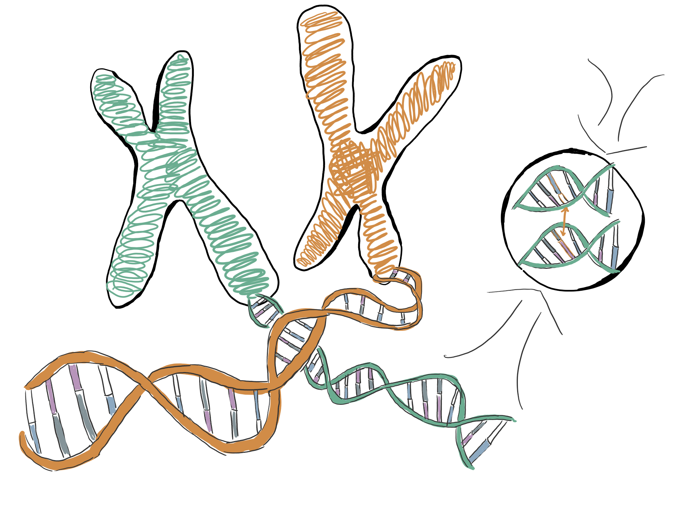

--- 
title: "Statistical Genetics Content Summary"
author: "Alayna Johnson"
date: "`r Sys.Date()`"
site: bookdown::bookdown_site
---

  
```{r, fig.cap="*Genetics Image*", out.width="50%", fig.show="hold", echo=FALSE}

```

# Introduction {-}

In the following chapters, you will find concepts and examples related to statistical genetics explained. This breakdown is more directed towards those who are familiar with RStudio coding and statistical concepts, but who may not be as familiar with genetics or biology. You will learn different terms and methodologies in statistical genetics.

Note that this site does not have all ideas and methods related to statistical genetics. This is only a small start, and there is much more to explore.
